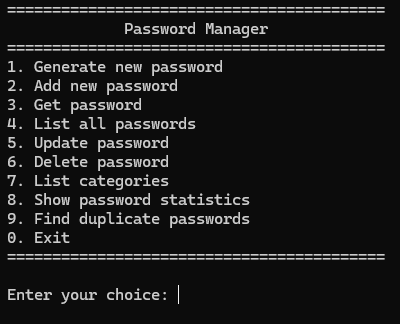
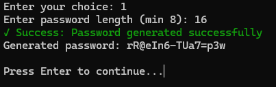
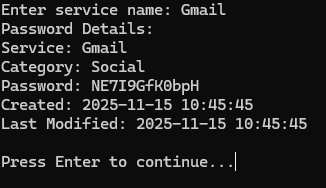
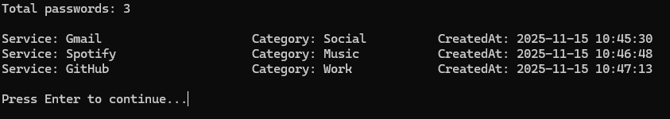
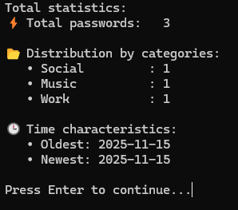
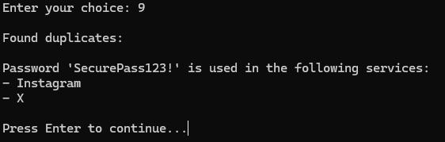
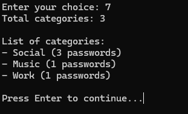

# 🔐 Password Manager


Безопасный командный менеджер паролей на Go с шифрованием AES-256 CFB, хранением данных в зашифрованном виде и удобным интерфейсом терминала.

## 📋 Содержание

- [Основные возможности](#основные-возможности)
- [Требования](#требования)
- [Установка](#установка)
- [Использование](#использование)
- [Примеры](#примеры)
- [Структура проекта](#структура-проекта)
- [Архитектура безопасности](#архитектура-безопасности)
- [Планы развития](#планы-развития)
- [Лицензия](#лицензия)

## 🎯 Основные возможности

### Управление паролями

- **Генерация безопасных паролей** — алгоритм генерации включает заглавные буквы, строчные буквы, цифры и спецсимволы
- **Добавление паролей** — сохранение паролей для сервисов/сайтов с категоризацией
- **Получение паролей** — поиск и отображение сохраненных паролей
- **Обновление паролей** — изменение значений существующих паролей
- **Удаление паролей** — безопасное удаление ненужных записей
- **Список всех паролей** — отображение всех сохраненных паролей в таблице

### Организация и анализ

- **Категоризация паролей** — группировка паролей по категориям (Social, Work, Finance, etc.)
- **Список категорий** — просмотр всех категорий с количеством паролей в каждой
- **Статистика паролей** — анализ: общее количество, распределение по категориям, даты создания
- **Поиск дубликатов** — обнаружение одинаковых паролей в разных сервисах

### Безопасность

- **AES-256 CFB шифрование** — все пароли шифруются перед сохранением в файл
- **Главный пароль** — единственный мастер-пароль для доступа к хранилищу
- **Скрытый ввод пароля** — при вводе пароль не отображается в терминале
- **Проверка надежности** — требование минимум 8 символов + буквы + цифры + спецсимволы
- **Вектор инициализации (IV)** — уникальный IV для каждого сеанса шифрования

## 📋 Требования

### Минимальные требования

| Параметр | Требование |
|----------|-----------|
| **ОС** | Linux, macOS, Windows |
| **Go** | 1.21 или выше |
| **Память** | 50 MB свободной памяти |
| **Процессор** | Любой современный процессор |

### Проверка требований

```bash
# Проверить версию Go
go version

# Проверить поддерживаемые платформы
go tool dist list
```

## 🚀 Установка

### Способ 1: Клонирование репозитория

```bash
git clone https://github.com/yourusername/PasswordManager.git
cd PasswordManager
go mod download
go build -o PasswordManager .
```

### Способ 2: Установка через go install

```bash
go install github.com/yourusername/PasswordManager@latest
```

### Способ 3: Установка в систему

```bash
# Собрать и установить в /usr/local/bin
sudo cp PasswordManager /usr/local/bin/
chmod +x /usr/local/bin/PasswordManager

# Теперь можно запустить отсюда угодно
PasswordManager
```

## 💻 Использование

### Запуск приложения

```bash
./PasswordManager
```

Первая проверка попросит вас установить главный пароль:


### Главное меню

После инициализации вы увидите главное меню с 10 вариантами:



## 📚 Примеры

### Пример 1: Генерация пароля



### Пример 2: Добавление пароля


### Пример 3: Получение пароля



### Пример 4: Список всех паролей



### Пример 5: Статистика паролей



### Пример 6: Поиск дубликатов



### Пример 7: Категории



## 🏗️ Структура проекта

```
PasswordManager/
├── main.go               ← Точка входа приложения
├── app.go                ← Функции ввода/вывода (ReadUserInput, ShowMainMenu)
├── ui.go                 ← UI компоненты (clearScreen, showSuccess, showError)
├── pass.go               ← Основная логика (Password, PasswordManager)
├── file.go               ← Сохранение/загрузка (SaveToFile, LoadFromFile)
├── category.go           ← Работа с категориями
├── handlers.go           ← Обработчики команд меню
├── errors.go             ← Пользовательские ошибки
├── go.mod                ← Go модуль
├── go.sum                ← Контрольные суммы зависимостей
├── README.md             ← Документация
└── LICENSE               ← MIT лицензия
```

### Описание файлов

**main.go** — Инициализация приложения, главный цикл обработки команд

**app.go** — Функции для работы с пользовательским вводом:
- `ReadUserInput()` — чтение строки ввода
- `readPassword()` — скрытый ввод пароля
- `ShowMainMenu()` — отображение главного меню

**ui.go** — Элементы пользовательского интерфейса:
- `clearScreen()` — очистка экрана
- `showSuccess()` — сообщение об успехе (зеленый текст)
- `showError()` — сообщение об ошибке (красный текст)
- `showInfo()` — информационное сообщение (желтый текст)

**pass.go** — Основная логика управления паролями:
- `Password` — структура для хранения информации о пароле
- `PasswordManager` — менеджер для работы с хранилищем паролей
- `GeneratePassword()` — генерация безопасного пароля
- `SavePassword()` — сохранение пароля
- `GetPassword()` — получение пароля
- `ListPasswords()` — список всех паролей
- `UpdatePassword()` — обновление пароля
- `DeletePassword()` — удаление пароля
- `CheckPasswordStrength()` — проверка надежности
- `FindDuplicatePasswords()` — поиск дубликатов
- `GetPasswordStats()` — получение статистики

**file.go** — Криптографические операции:
- `SaveToFile()` — сохранение паролей в зашифрованный файл (AES-256 CFB)
- `LoadFromFile()` — загрузка и расшифровка паролей из файла

**category.go** — Работа с категориями:
- `GetPasswordsByCategory()` — получение паролей категории
- `ListCategories()` — список всех категорий

**handlers.go** — Обработчики для каждой команды меню:
- `HandlePasswordGeneration()` — генерация пароля
- `HandlePasswordAdd()` — добавление пароля
- `HandlePasswordSearch()` — поиск пароля
- `HandlePasswordList()` — список паролей
- `HandlePasswordUpdate()` — обновление пароля
- `HandlePasswordDelete()` — удаление пароля
- `HandlePasswordStats()` — статистика
- `HandlePasswordDuplicate()` — поиск дубликатов
- `HandleExitAndSave()` — сохранение и выход

**errors.go** — Пользовательские ошибки:
- `ErrPassManagerNotInit` — менеджер не инициализирован
- `ErrPassExists` — пароль уже существует
- `ErrPassNotFound` — пароль не найден
- `ErrPassWeak` — слабый пароль

## 🔒 Архитектура безопасности

### Шифрование

**Алгоритм:** AES-256 CFB (Cipher Feedback Mode)
- **Размер ключа:** 256 бит (32 байта)
- **Размер блока:** 128 бит (16 байт)
- **Режим:** CFB (потоковый режим)

**Процесс сохранения:**
```
1. Преобразовать map паролей в JSON
2. Сгенерировать случайный IV (вектор инициализации)
3. Создать AES шифр с мастер-паролем
4. Зашифровать JSON данные
5. Сохранить: [IV (16 байт)] + [Зашифрованные данные]
```

**Процесс загрузки:**
```
1. Открыть файл
2. Прочитать первые 16 байт (IV)
3. Прочитать оставшиеся байты (зашифрованные данные)
4. Создать AES расшифровщик с мастер-паролем
5. Расшифровать данные
6. Преобразовать JSON обратно в map паролей
```

### Валидация паролей

Требования к паролям:
- **Минимальная длина:** 8 символов
- **Заглавные буквы:** A-Z (обязательны)
- **Строчные буквы:** a-z (обязательны)
- **Цифры:** 0-9 (обязательны)
- **Спецсимволы:** !@#$%^&* (обязательны)

### Защита данных

- **Главный пароль:** Преобразуется в 32-байтовый ключ
- **Синхронизация:** Использование `sync.RWMutex` для потокобезопасности
- **Скрытый ввод:** Использование `golang.org/x/term` для скрытия ввода пароля
- **Безопасное удаление:** При удалении пароля из памяти он полностью удаляется

## 📊 Структуры данных

### Password

```go
type Password struct {
    Name         string    `json:"name"`           // Название сервиса
    Value        string    `json:"value"`          // Значение пароля
    Category     string    `json:"category"`       // Категория
    CreatedAt    time.Time `json:"createdAt"`      // Дата создания
    LastModified time.Time `json:"lastModified"`   // Дата изменения
}
```

### PasswordManager

```go
type PasswordManager struct {
    passwords     map[string]Password  // map: название -> пароль
    masterKey     []byte               // 32-байтовый ключ шифрования
    filePath      string               // Путь к файлу хранилища
    isInitialized bool                 // Инициализирован ли менеджер
    mu            sync.RWMutex         // Синхронизация доступа
}
```

## 🔄 Поток выполнения

```
main()
  ↓
Инициализация PasswordManager
  ↓
Запрос главного пароля
  ↓
SetMasterPassword() - установка мастер-пароля
  ↓
LoadFromFile() - загрузка существующих паролей
  ↓
ShowMainMenu() - отображение меню
  ↓
Цикл обработки команд:
  ├─ 1: HandlePasswordGeneration
  ├─ 2: HandlePasswordAdd
  ├─ 3: HandlePasswordSearch
  ├─ 4: HandlePasswordList
  ├─ 5: HandlePasswordUpdate
  ├─ 6: HandlePasswordDelete
  ├─ 7: HandlePasswordListCategories
  ├─ 8: HandlePasswordStats
  ├─ 9: HandlePasswordDuplicate
  └─ 0: HandleExitAndSave → SaveToFile() → Exit
```

## 🚀 Планы развития

### Версия 1.1 (краткосрочные)

- [ ] Клиент-серверная архитектура (REST API)
- [ ] Синхронизация паролей между устройствами
- [ ] Экспорт в CSV/JSON (незашифрованный)
- [ ] Импорт из популярных менеджеров паролей
- [ ] Поддержка двухфакторной аутентификации
- [ ] Восстановление пароля с security question

### Версия 1.2 (среднесрочные)

- [ ] Web интерфейс (Go + React)
- [ ] Поддержка биометрии (отпечаток пальца, Face ID)
- [ ] История изменений паролей
- [ ] Автоматическое изменение пароля
- [ ] Интеграция с браузерами (плагины)
- [ ] Анализ утечек данных (Have I Been Pwned API)

### Версия 2.0 (долгосрочные)

- [ ] Desktop приложение (Electron/Go)
- [ ] Mobile приложение (iOS, Android)
- [ ] Облачное хранилище
- [ ] Поддержка USB ключей (YubiKey)
- [ ] Оффлайн режим с синхронизацией
- [ ] AI рекомендации по паролям

## 🔧 Разработка

### Требования для разработчиков

```bash
# Установить Go 1.21+
go version

# Загрузить зависимости
go mod download

# Сборка
go build -o PasswordManager .

# Запуск
./PasswordManager
```

### Форматирование кода

```bash
# Форматировать весь код
go fmt ./...
```

### Тестирование (будущее)

```bash
go test -v ./...
go test -cover ./...
```

## 💡 Советы по безопасности

1. **Используйте сильный главный пароль:**
   - Минимум 12 символов
   - Смешивайте типы символов
   - Не используйте личную информацию

2. **Регулярно обновляйте пароли:**
   - Критичные сервисы: каждый месяц
   - Остальные: каждые 3 месяца

3. **Избегайте дубликатов:**
   - Используйте функцию "Find duplicate passwords"
   - Генерируйте уникальные пароли для каждого сервиса

4. **Создавайте резервные копии:**
   - Регулярно копируйте файл `ne_password.dat`
   - Храните на защищенном устройстве

5. **Защитите файл данных:**
   ```bash
   chmod 600 ne_password.dat  # Только владелец может читать
   ```

## 📝 Лицензия

Проект распространяется под лицензией **MIT**.

```
MIT License

Copyright (c) 2025 Password Manager Contributors

Permission is hereby granted, free of charge, to any person obtaining a copy
of this software and associated documentation files (the "Software"), to deal
in the Software without restriction...
```

## 🎉 История версий

- **v1.0.0** (2025-11-15) — Начальный релиз с основной функциональностью

---

